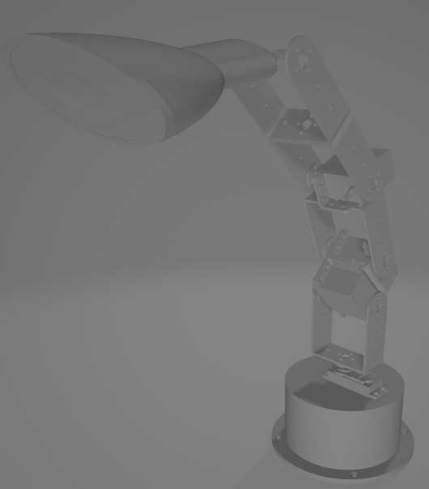

# 🤖 로봇팔 초기 3D 설계 (6주차)

## 📌 사용 재료

- **지지대**: Arduino Uno R3 호환 보드  
- **모터터**: MG996R 서보모터  
- **로봇팔 프레임**: MG996R 서보모터 브라켓 
- **사용 툴**: Tinkercad

---

## 🧠 개발 구상

### ✅ 목표

1. 로봇팔의 임시 모델 제작
2. 이후 목표과정 설립

### ✅ 전체 구조

실제로 결합되었을때 브라켓이 회전되는 부분과 고정되는 부분을 생각하여 제작

1. 지지대는 기존 로봇팔 지지대를 수정하여. 좌우 회전 모터가 삽입될 수 있도록 함
2. 모터가 앞뒤, 좌우, 위아래 회전기능을 각각 가지고 있도록 함 

---

## 🧾 초기 로봇팔 3D 설계

## 🔄 이후 과정

1. **지속적인 로봇팔 설계 수정**
   - 로봇팔이 실제 동작 시 안정적으로 움직일 수 있도록 지속적인 설계 수정

2. **코드 수정**
   - 로봇팔이 실제 동작 시 안정적으로 움직일 수 있도록 지속적인 설계 수정

3. **조명부분 수정**
   - 조명이 자연스럽게 들어갈 수 있도록 로봇팔 끝부분 추후 수정